<div align="center">
  <h1>LazyHire</h1>
  <p>A private AI career workspace for Kerala job seekers, combining source-validated openings, explainable matching, and evidence-based CV tailoring.</p>
  <p>
    <a href="https://nextjs.org/"></a>
    <a href="https://react.dev/"></a>
    <a href="https://www.typescriptlang.org/"></a>
    <a href="https://orm.drizzle.team/"></a>
    <a href="https://playwright.dev/"></a>
  </p>
  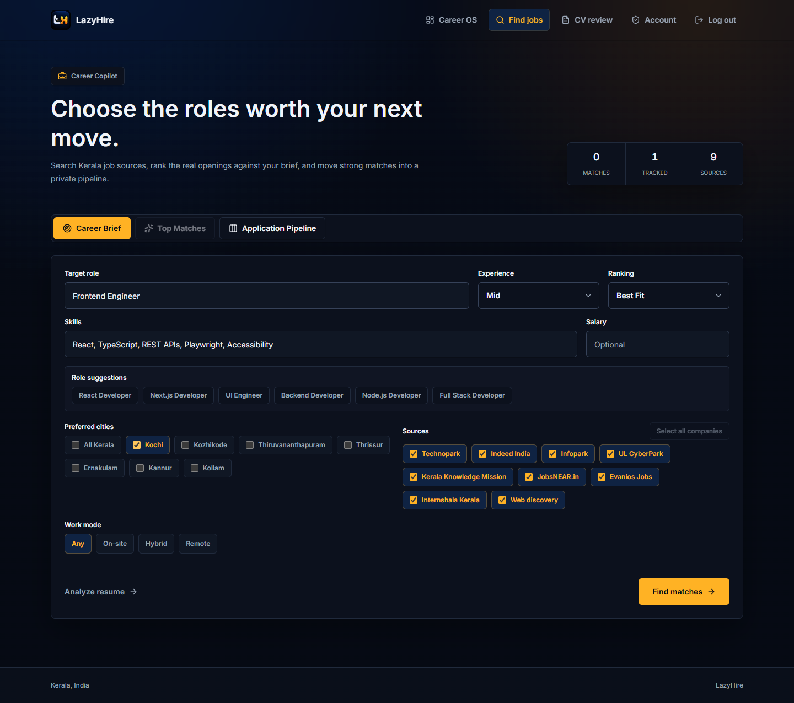
  <p>Set a career brief, search Kerala sources, and review matches in one workspace.</p>
  <p><a href="#demo">Demo</a> | <a href="docs/career-tutor.md">Docs</a> | <a href="#architecture">Architecture</a> | <a href="#getting-started">Quickstart</a></p>
  <p>Repository: <a href="https://github.com/vinayak533/lazyhire">github.com/vinayak533/lazyhire</a></p>
</div>

<details>
<summary>Contents</summary>

- [Problem and Solution](#problem-and-solution)
- [Key Features](#key-features)
- [Demo / Screenshots](#demo)
- [Architecture](#architecture)
- [Tech Stack](#tech-stack)
- [Engineering Highlights](#engineering-highlights)
- [Getting Started](#getting-started)
- [Project Structure](#project-structure)
- [Testing and Quality](#testing-and-quality)
- [Roadmap](#roadmap)
- [Author](#author)
- [License and Acknowledgements](#license-and-acknowledgements)

</details>

<a id="problem-and-solution"></a>

## 🎯 Problem and Solution

Kerala job discovery spans multiple sources with duplicate postings, missing dates, and links that may lead only to company homepages.
LazyHire validates application paths, merges duplicates, and ranks openings against a candidate brief with visible fit explanations.

PDF/DOCX review, guarded AI tailoring, application tracking, and Career OS connect discovery to preparation and follow-through.
The career assistant retrieves authored knowledge before optional LLM fallback; unavailable sources and uncertain answers remain explicit.

<a id="key-features"></a>

## ✨ Key Features

- **Source-aware discovery and deduplication:** search Technopark, Infopark, UL CyberPark, Evanios Jobs, Indeed India fallback, Kerala Knowledge Mission, JobsNEAR.in, Internshala Kerala, and web discovery; canonical URLs, company, normalized title, and location collapse repeated listings.
- **Validated application paths:** show `Apply` for credible posting or applicant-tracking URLs, label generic pages `Company Website`, and confirm external navigation so candidates can distinguish application routes from weak signals.
- **Explainable match ranking:** combine freshness, source quality, location, role fit, skills overlap, and candidate preferences to make each ranking inspectable.
- **Application tracking:** move opportunities through `Saved`, `Applied`, `Interview`, and `Rejected` states to keep follow-up work in the same workspace.
- **Private CV analysis:** parse PDF and DOCX uploads, score writing quality, highlight issues, and store extracted text privately so candidates can review the evidence behind suggestions.
- **Guarded AI review and tailoring:** optionally sharpen existing CV evidence while rejecting invented experience, metrics, tools, or credentials.
- **Evidence-driven Career OS:** combine target role, CV evidence, saved applications, skill gaps, roadmap blocks, simulations, and next actions into a readiness snapshot.
- **Context-controlled career assistant:** retain session history and feedback, accept CV uploads inside chat, and group verified YouTube, official, and learning resources; privacy preferences control profile use and external AI fallback.

<p align="center">
  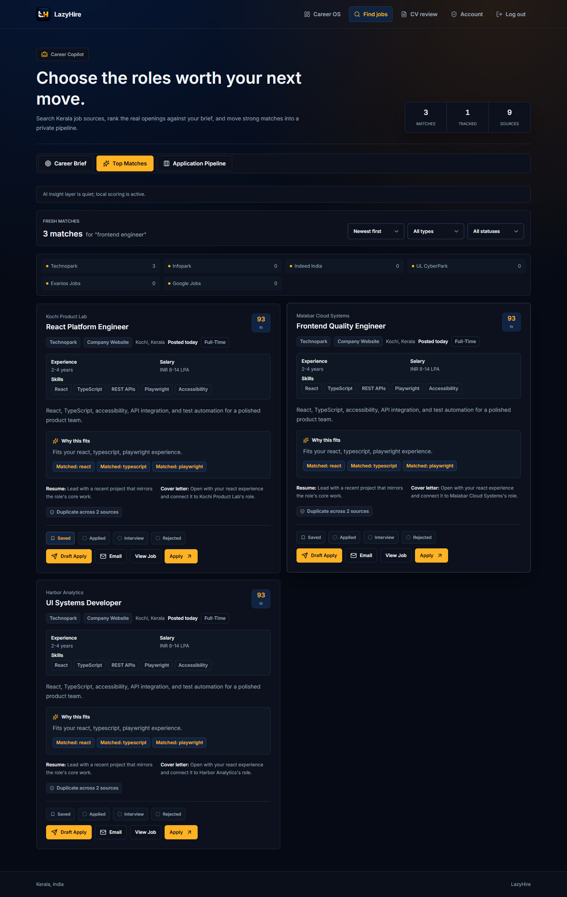
</p>

Matches expose their sources and application actions; missing dates, slow providers, and unavailable sources are disclosed.

<a id="demo"></a>

## 📸 Demo / Screenshots

All 12 showcase images are checked into `portfolio-images/`, so the product can be reviewed without a live deployment. The search workspace and ranked matches appear above; the remaining screens are below.

| Secure onboarding | Private access |
| --- | --- |
| 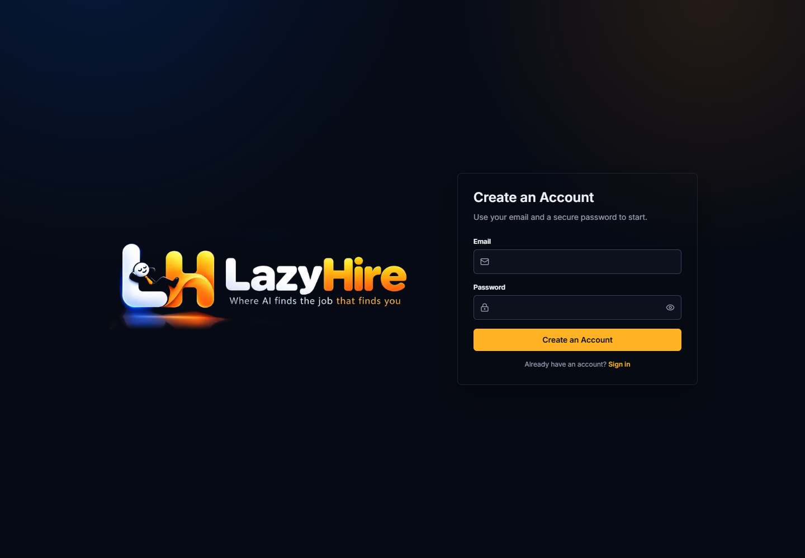 | 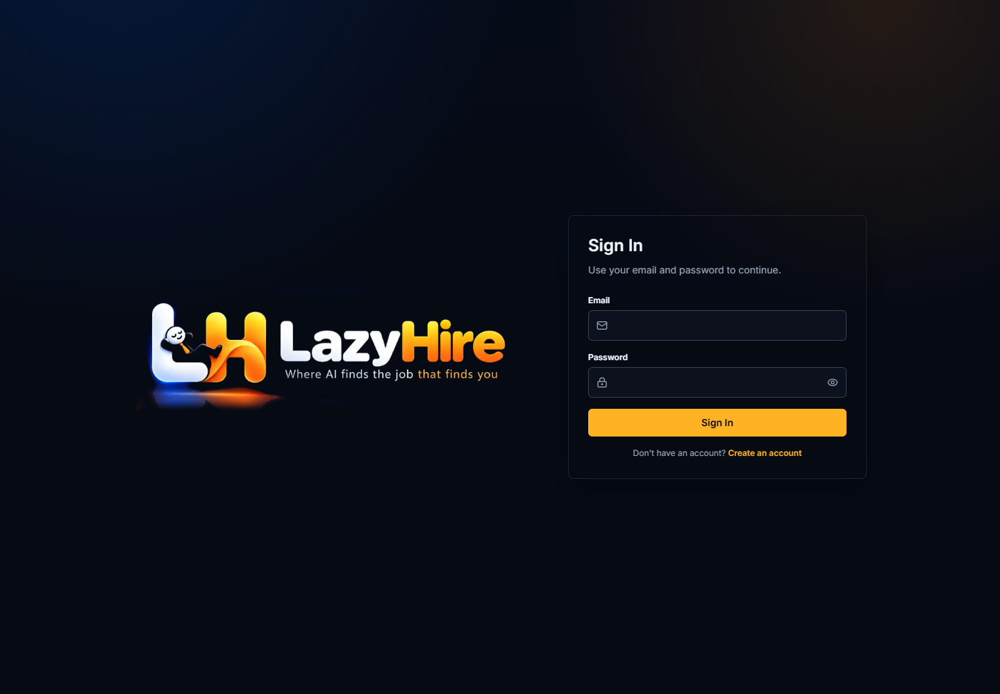 |
| Create a candidate account. | Sign in to the private workspace. |

| Job detail | Application pipeline |
| --- | --- |
| 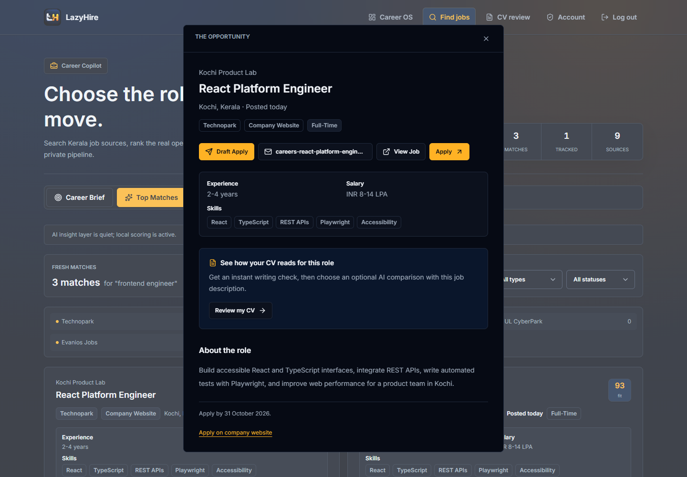 | 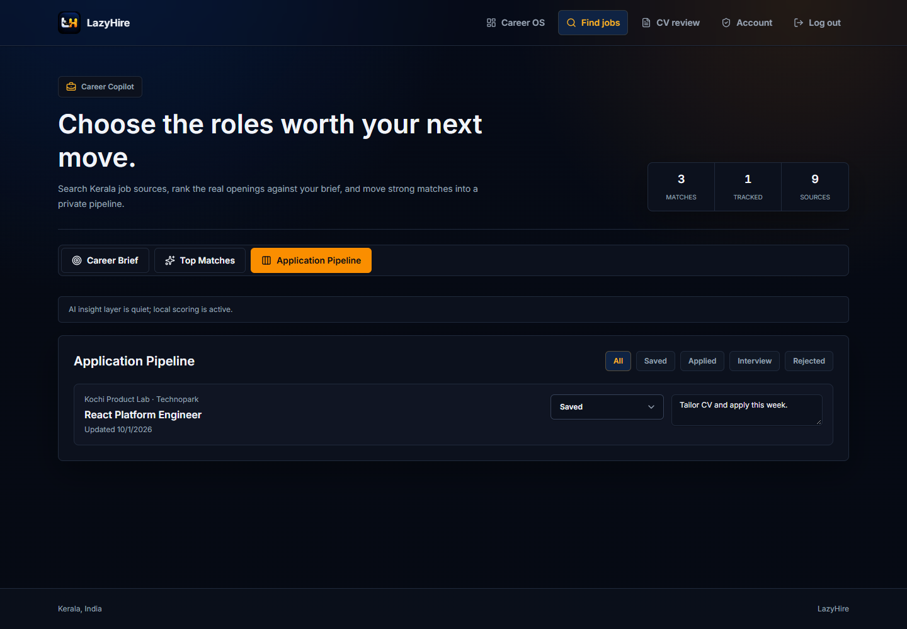 |
| Inspect posting and application routes. | Track applications across stages. |

| CV review | CV tailoring |
| --- | --- |
| 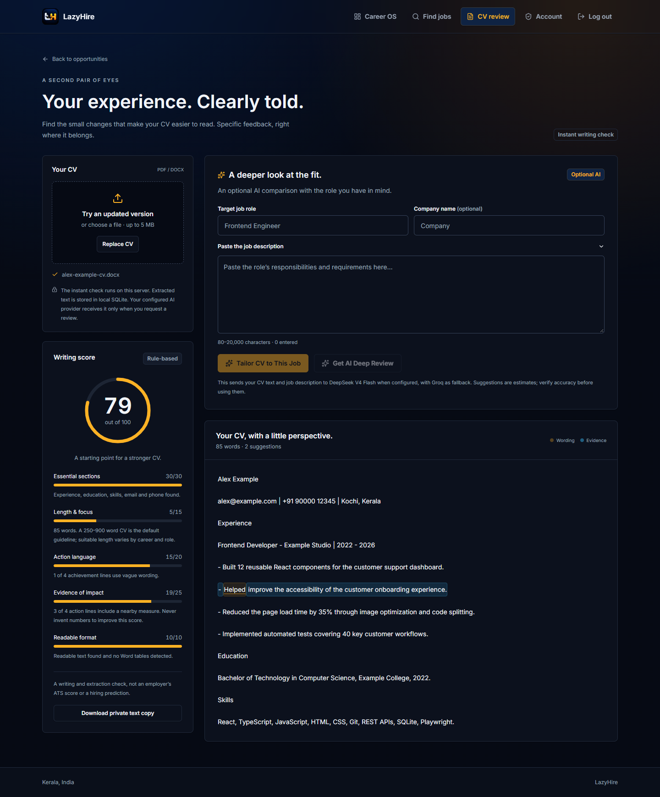 | 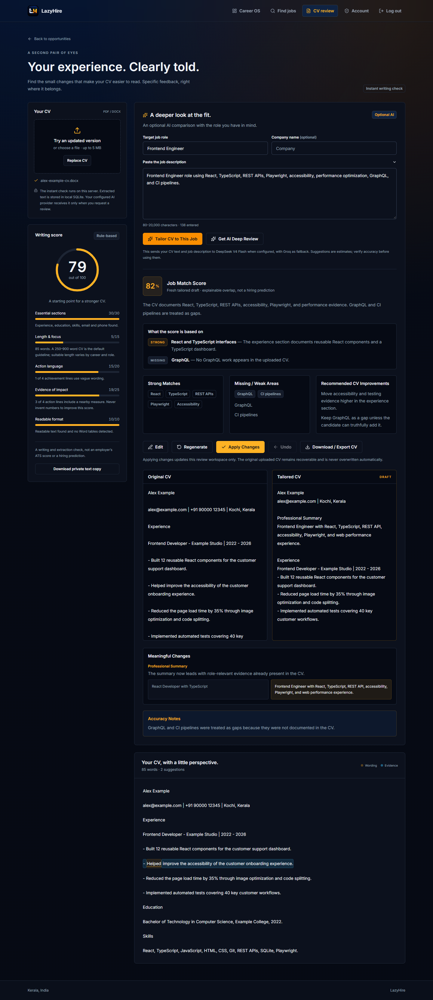 |
| Review writing quality and suggested changes. | Compare the tailored draft with existing evidence. |

| Career OS | AI Career Assistant |
| --- | --- |
| 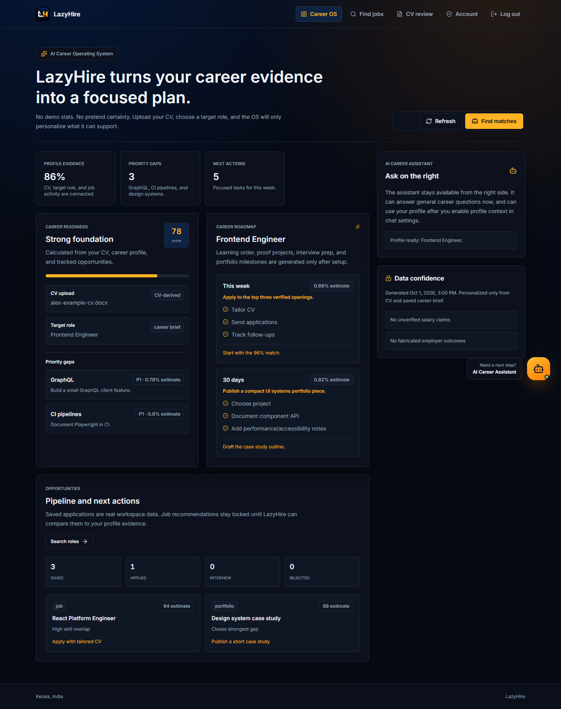 | 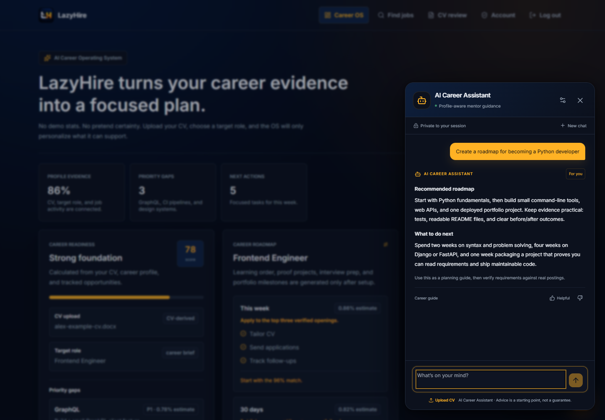 |
| Plan next actions from the candidate snapshot. | Read answers alongside grouped resources. |

| Account privacy | Design system |
| --- | --- |
| 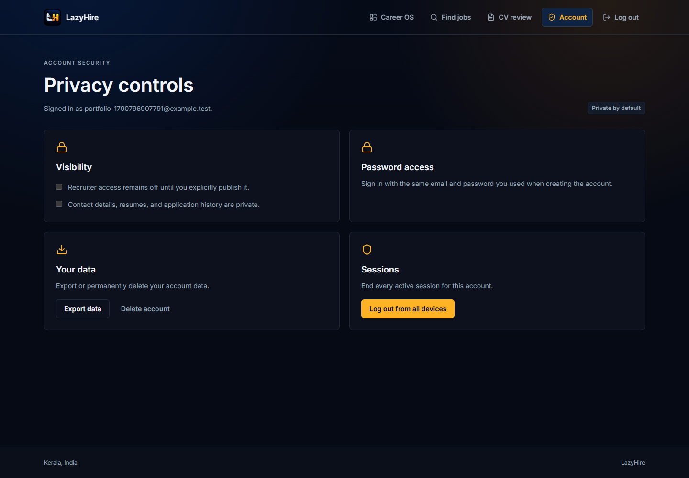 | 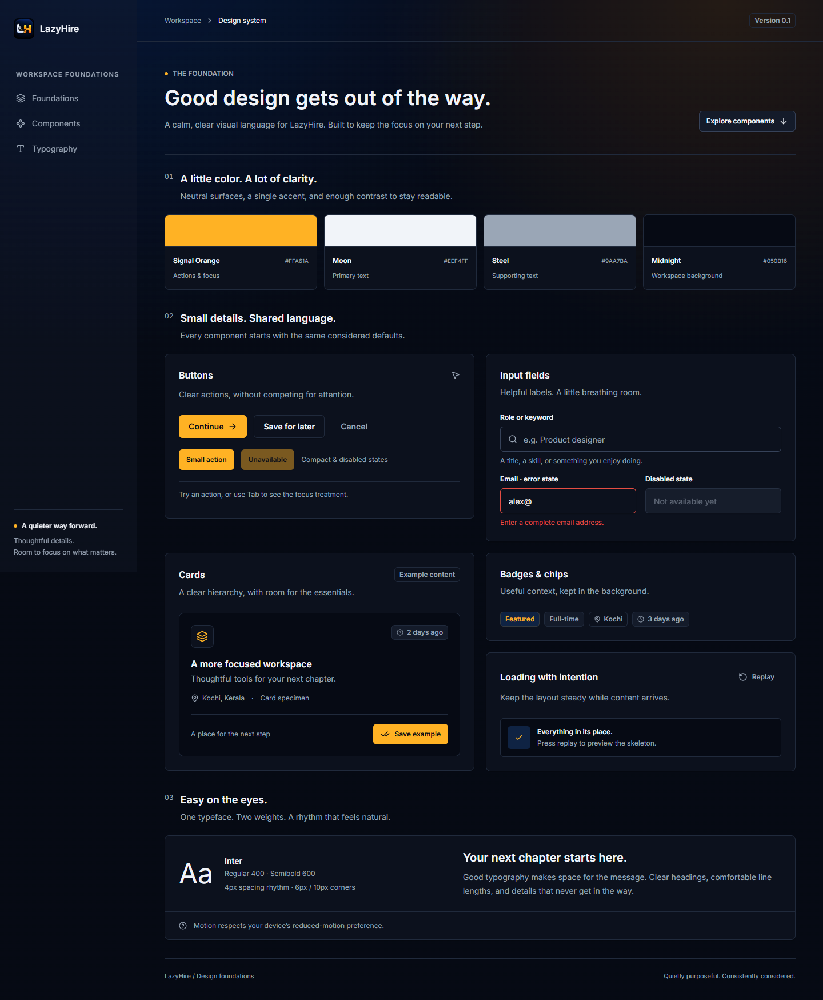 |
| Manage account and privacy preferences. | Inspect shared interface components. |

<a id="architecture"></a>

## 🏗️ Architecture

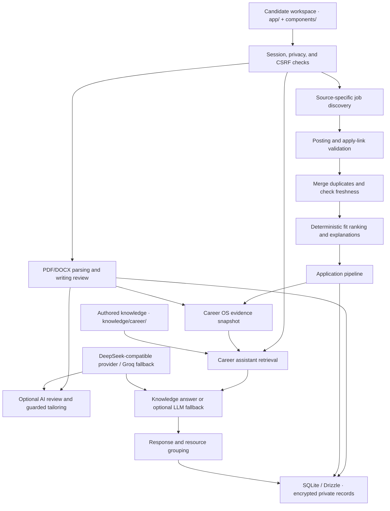

- **Separate discovery from ranking:** source-specific retrieval, validation, merging, and deterministic scoring keep posting evidence distinct from candidate fit.
- **Prefer partial results to hidden failures:** independent source deadlines and warnings expose blocked or unavailable providers; a SQLite cache uses a documented 45-minute TTL.
- **Retrieve before generating:** the assistant uses authored knowledge and optional local embeddings before configured LLM fallback, with privacy preferences gating external AI use.
- **Keep private state behind server checks:** sessions, CSRF protection, encrypted persistence, and no-store responses protect candidate and conversation data.
- **Use local infrastructure deliberately:** SQLite, file-based config, knowledge imports, and deterministic tests support local development; production needs persistent storage and compatible native Node packages rather than a stateless or Edge deployment.

The assistant is documented as a functioning pilot. The 4,000-entry content gate, broader expert review, and independent release evaluation remain incomplete; see [implementation notes and limits](docs/career-tutor.md).

<a id="tech-stack"></a>

## 🧰 Tech Stack

| Layer | Tools | Purpose |
| --- | --- | --- |
| Frontend | Next.js 16 App Router, React 19, TypeScript 5.9 | Typed pages, components, and workspace interactions |
| Frontend | Tailwind CSS, local Inter font, shadcn-style primitives, Radix Slot, lucide-react | Shared styling, typography, and UI components |
| Backend | Next.js route handlers, Node.js | Authentication, search, CV, application, and assistant APIs |
| Backend | pdf-parse, mammoth | PDF and DOCX text extraction with upload checks |
| AI/ML | DeepSeek-compatible review path, Groq fallback | Optional CV review, tailoring, and assistant generation |
| AI/ML | Authored tutor corpus, Transformers.js, local MiniLM embeddings | Knowledge retrieval and local semantic encoding |
| Data | SQLite, better-sqlite3, Drizzle ORM, FTS5 | Local records, migrations, full-text retrieval, and encrypted private persistence |
| Infra | Local files, persistent SQLite storage, local model cache | Development without managed infrastructure and deployment persistence |
| DevOps | Node test runner, Playwright, ESLint, TypeScript checks | Backend/browser coverage and static checks |

<a id="engineering-highlights"></a>

## ⚙️ Engineering Highlights

| Problem | Approach | Result |
| --- | --- | --- |
| Duplicate postings and unreliable application links | Canonical URL and company/title/location deduplication; posting and apply-link validation | Repeated listings are merged; generic homepages are labelled `Company Website`; uncertain source signals remain visible. |
| AI tailoring can introduce unsupported CV claims | Evidence-constrained prompts and `lib/cv/tailor-guardrails.ts` | Guardrails reject fabricated numbers, unsupported requirements, and untraceable changes. Drafts may reorganize existing evidence without inventing credentials. |
| Career answers can be irrelevant or unverifiable | Authored retrieval with relevance gates; optional provider fallback with source/excerpt validation | Knowledge answers avoid generation calls; unsupported current-data claims receive uncertainty and official resources. |
| CV uploads and private sessions expose sensitive data | `proxy.ts` session checks, `secureFetch` CSRF protection for state-changing requests, per-request CSP nonce, rate limits, audit events, and upload scanning | Uploads are checked for size, type, parseability, and unsafe payloads before storage; sensitive CV/account data is encrypted and private responses use no-store headers. The CSP nonce permits hydration without blanket inline scripts. |
| Assistant context and browser state can outlive user intent | Profile-use preferences, session-scoped conversations, and storage cleanup | Preferences control profile context; session clearing removes current and legacy browser storage keys. |

<a id="getting-started"></a>

## 🚀 Getting Started

### Prerequisites and install

Use Node.js `20.9` or newer and npm, with Windows PowerShell, a macOS terminal, or a Linux shell.

```bash
git clone https://github.com/vinayak533/lazyhire.git
cd lazyhire
npm install
```

### Configure

Copy the tracked environment example to `.env.local`:

```bash
cp .env.local.example .env.local
```

Local development can run without live AI, search, or email keys. Configure integrations using the variable names in [.env.local.example](.env.local.example); credentials remain server-only and must never use the `NEXT_PUBLIC_` prefix.

| Purpose | Environment variables |
| --- | --- |
| Indeed search fallback | `SERPAPI_KEY` |
| AI providers | `DEEPSEEK_API_KEY`, `GROQ_API_KEY`, `AI_PROVIDER`, `DEEPSEEK_BASE_URL` |
| Email verification | `RESEND_API_KEY`, `APP_BASE_URL`, `EMAIL_FROM` |
| Optional SMTP delivery | `SMTP_HOST`, `SMTP_PORT`, `SMTP_USER`, `SMTP_PASS`, `SMTP_SECURE` |
| Development email outbox | `EMAIL_DEV_OUTBOX` |
| Authentication and encryption | `AUTH_SECRET`, `AUTH_HMAC_SECRET`, `DATA_ENCRYPTION_KEY` |
| Local storage | `DATABASE_PATH`, `TUTOR_MODEL_CACHE` |

Production requires independent 32+ character auth/encryption secrets and email verification configuration. The default database path is `./data/orvio.sqlite`; the default model cache is `./data/models`.

### Initialize and run

Apply migrations and import authored career knowledge:

```bash
npm run db:migrate
npm run kb:import
```

Optionally populate the local embedding cache for semantic retrieval:

```bash
npm run kb:embed
```

Start development:

```bash
npm run dev
```

Open `http://127.0.0.1:3000`. See [career tutor setup and maintenance](docs/career-tutor.md) for model caching, corpus audits, retention, and deployment constraints.

<details>
<summary>Application and maintenance commands</summary>

| Command | Purpose |
| --- | --- |
| `npm run dev` | Start the local Next.js development server |
| `npm run build` | Build the production app |
| `npm run start` | Serve the production build |
| `npm run lint` | Run ESLint |
| `npm run typecheck` | Run TypeScript checks |
| `npm run test` | Run the Node test suite |
| `npm run test:e2e` | Run Playwright browser tests |
| `npm run db:migrate` | Apply SQLite migrations |
| `npm run db:check` | Verify database connectivity |
| `npm run kb:import` | Import authored career tutor knowledge |
| `npm run kb:embed` | Build the local embedding cache |
| `npm run brand:assets` | Regenerate LazyHire brand assets |

</details>

<a id="project-structure"></a>

## 📂 Project Structure

```text
job-hunter/
├── app/                   # App Router pages and API route handlers
├── components/            # App shell, job cards, CV workspace, Career OS, UI
├── lib/
│   ├── auth/              # Sessions and password authentication
│   ├── career/            # Candidate brief, ranking, application state
│   ├── jobs/              # Search, validation, merging, freshness, apply links
│   ├── sources/           # Source-specific discovery adapters
│   ├── cv/                # Parsing, scoring, storage, tailoring guardrails
│   ├── career-os/         # Evidence-driven snapshot engine
│   ├── career-tutor/      # Retrieval, authored knowledge, chat persistence
│   ├── db/                # SQLite connection and Drizzle schema
│   └── security/          # Rate limits, crypto, audit, uploads, HTTP helpers
├── knowledge/career/      # Authored assistant corpus and resource registry
├── drizzle/               # SQLite migrations
├── scripts/               # Database, knowledge, evaluation, and asset tooling
├── tests/                 # Node tests and Playwright browser coverage
├── docs/                  # Tutor implementation and phase checkpoints
├── portfolio-images/      # All 12 repository showcase screenshots
└── proxy.ts               # Private-route session checks and request CSP nonce
```

Authentication endpoints under `app/api/auth/` include MFA setup/enable, password reset, email verification, and session revocation.

<a id="testing-and-quality"></a>

## ✅ Testing and Quality

The repository includes Node tests and Playwright browser coverage. The commands below are the documented verification workflow.

```bash
npm run lint
npm run typecheck
npm run build
npm run db:check
npm run test
npm run test:e2e
```

| Coverage | Scope |
| --- | --- |
| Node tests | Backend, job discovery, security, assistant retrieval/resources, and smoke coverage |
| Browser tests | Auth flows, discovery states, apply-link behavior, CV analysis/tailoring, Career OS, assistant resources, and privacy boundaries |
| Static and build checks | ESLint, TypeScript, production build, and database connectivity |

[Tutor evaluation notes](docs/career-tutor.md) document calibration and abstention checks, along with the independent benchmark and broader accessibility/load testing still required before release.

<a id="roadmap"></a>

## 🗺️ Roadmap

- [ ] Expand the authored Career Assistant corpus toward the 4,000-entry release gate.
- [ ] Add more first-party employer and campus placement sources.
- [ ] Improve source health telemetry and historical provider reliability tracking.
- [ ] Add import/export flows for application history.
- [ ] Add optional deployment documentation for production hosting.

<a id="author"></a>

## 👤 Author

**Vinayak K V** · AI/ML Engineer at AMnova Technologies

[GitHub](https://github.com/vinayak533) · [LinkedIn](https://linkedin.com/in/vinayak-kv-ds) · [Email](mailto:vinayakkvjob@gmail.com)

Building production multi-agent AI systems. Open to technical discussions and collaboration.

<a id="license-and-acknowledgements"></a>

## 📄 License and Acknowledgements

No license file is currently included. Treat this repository as all-rights-reserved until a license is added.

Local semantic retrieval uses `Xenova/all-MiniLM-L6-v2` through Transformers.js with CPU quantized ONNX inference, as documented in [the career tutor implementation](docs/career-tutor.md).
